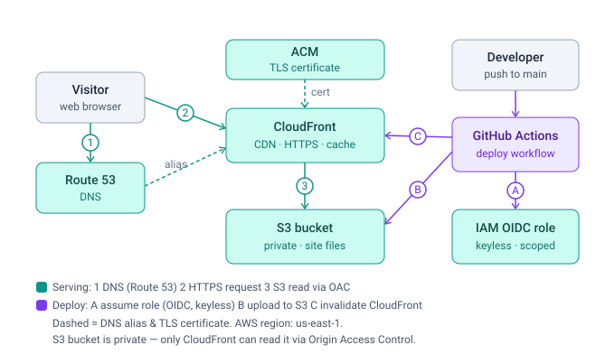

# Infrastructure & Deployment

How this site is hosted on AWS and how it ships automatically on every push to `main`.
Written to be readable end‑to‑end — no prior AWS knowledge assumed.

---

## TL;DR

The site is a set of **static files** (HTML, CSS, JS) produced by an Angular build.
Those files live in a **private S3 bucket**. **CloudFront** (a global CDN) sits in front of
the bucket, terminates HTTPS, and serves the files fast from edge locations worldwide.
**Route 53** points the domain at CloudFront, and **ACM** provides the TLS certificate.

Shipping is fully automated: a **push to `main`** triggers a **GitHub Actions** pipeline that
builds the site, uploads it to S3, and clears the CloudFront cache. GitHub authenticates to AWS
with **short‑lived credentials via OIDC** — there are **no AWS access keys stored anywhere**.

---

## AWS services at a glance

| Service | What it does here | Why it's used |
|---|---|---|
| **S3** | Stores the built static files (the "origin") | Cheap, durable, simple object storage |
| **CloudFront** | CDN + HTTPS in front of S3 | Speed (edge caching), TLS, custom domain, hides the bucket |
| **ACM** (Certificate Manager) | Issues & auto‑renews the TLS certificate | Free certificates, no manual renewal |
| **Route 53** | DNS — maps `rafaelinfante.net` → CloudFront | Domain registration + DNS in one place, native CloudFront alias |
| **IAM** (OIDC provider + role) | Lets GitHub deploy without stored secrets | Keyless, short‑lived, least‑privilege access |

Region for the certificate and the deploy is **`us-east-1`** (CloudFront requires its
certificate to live in `us-east-1`).

---

## The big picture

There are two independent flows. One is how a **visitor** reaches the site; the other is how
**new code** reaches production.



_Diagram file: [`architecture.svg`](architecture.svg) — a self-contained SVG that renders in any
viewer (GitHub, editor previews, browsers, slides), so it never falls back to raw text._

---

## Part 1 — Hosting (how a visitor reaches the site)

### The components

- **S3 bucket (`rafaelinfante-net-site`)** — holds the build output. It is **private**:
  "Block all public access" is **on**, and there is **no website hosting / public read**.
  Nothing in the bucket can be reached directly over the internet.

- **CloudFront distribution** — the public face of the site. It:
  - terminates **HTTPS** using the ACM certificate,
  - serves the apex (`rafaelinfante.net`) and `www` via its **Alternate Domain Names (CNAMEs)**,
  - **redirects HTTP → HTTPS**,
  - serves `index.html` as the **default root object**,
  - **caches** files at edge locations close to the visitor.

- **Origin Access Control (OAC)** — the key security piece. CloudFront reads from the
  private bucket using a **signed request** that only CloudFront can make. The S3 **bucket
  policy** grants read access *only* to this CloudFront distribution. Result: the bucket stays
  private, and the **only** way to the files is through CloudFront (HTTPS, cached, on our domain).

- **ACM certificate** — a free TLS certificate covering `rafaelinfante.net` and
  `www.rafaelinfante.net`, validated by DNS (a record in Route 53) and **auto‑renewed**.

- **Route 53 hosted zone** — DNS for the domain. The apex and `www` are **alias records**
  pointing at the CloudFront distribution (an alias is an AWS‑native pointer that works at the
  domain root, where a normal CNAME isn't allowed).

### A single request, step by step

1. Browser asks for `rafaelinfante.net` → **Route 53** answers with CloudFront's address (alias).
2. Browser opens an **HTTPS** connection to **CloudFront**; the **ACM** cert proves the identity.
3. If CloudFront already has the file cached at a nearby edge → it returns it immediately.
4. Otherwise CloudFront fetches it from **S3** over an **OAC‑signed** request, caches it, and returns it.
5. The browser receives static HTML and renders the page. (The Angular app is **prerendered**,
   so the first paint is real HTML, then the JavaScript "hydrates" it into an interactive app.)

> This is why the site is fast and resilient: most requests never touch S3 — they're served from
> the CDN edge.

---

## Part 2 — Automated deployment (how code reaches production)

Deployment is a **GitHub Actions** workflow at [`.github/workflows/deploy.yml`](../.github/workflows/deploy.yml).
It runs on **every push to `main`** (and can be run manually).

### How GitHub talks to AWS — OIDC, no stored keys

The interesting part is **authentication**. Instead of saving an AWS access key/secret in GitHub
(a long‑lived credential that can leak), we use **OIDC federation**:

1. An **IAM OIDC identity provider** is registered in AWS, trusting GitHub's token issuer
   (`token.actions.githubusercontent.com`).
2. An **IAM role** (`rafaelinfante-net-github-deploy`) has a **trust policy** that says:
   *"GitHub Actions may assume me — but only from this repository, and only on the `main` branch."*
3. At deploy time, GitHub hands a signed **OIDC token** to AWS STS. AWS verifies it and returns
   **temporary credentials** (valid for ~1 hour). The job uses those and they then expire.

So there is **no secret to store, rotate, or leak** — and even if the token were captured, it only
works for this repo's `main` branch.

### Least‑privilege permissions

The role can do **only** what a deploy needs — nothing more:

| Action | Scope |
|---|---|
| `s3:ListBucket` | the site bucket |
| `s3:PutObject`, `s3:GetObject`, `s3:DeleteObject` | objects inside the site bucket |
| `cloudfront:CreateInvalidation` | the one CloudFront distribution |

It cannot touch any other bucket, service, or account resource.

### What the pipeline does

Configuration values (which bucket, which distribution, which role) are stored as **GitHub
repository variables** — not secrets, because none are sensitive:
`AWS_ROLE_ARN`, `AWS_REGION`, `S3_BUCKET`, `CLOUDFRONT_DISTRIBUTION_ID`.

The job, in order:

1. **Checkout** the code.
2. **Set up Node** using the version pinned in `.nvmrc`, with npm caching.
3. **`npm ci`** — install dependencies from the lockfile.
4. **`npm test`** — run unit tests (the deploy fails if tests fail).
5. **`npm run build`** — produce the prerendered static site in `dist/rafaelinfante-net/browser/`.
6. **Assume the AWS role via OIDC** (`aws-actions/configure-aws-credentials`).
7. **`aws s3 sync … --delete`** — upload changed files and remove deleted ones, so the bucket
   exactly mirrors the new build.
8. **`aws cloudfront create-invalidation --paths "/*"`** — tell CloudFront to drop its cache so
   visitors get the new version immediately instead of waiting for the cache to expire.

The whole run takes well under a minute.

### A single deploy, step by step

```
merge/push to main
      │
      ▼
GitHub Actions starts ──► build + test the Angular app
      │
      ├─► request OIDC token ──► AWS STS ──► temporary credentials
      │
      ├─► aws s3 sync  ──────► new files land in the private S3 bucket
      │
      └─► invalidate CloudFront ──► edge caches refreshed ──► site is live
```

---

## Part 3 — Why it's built this way (design decisions)

- **Private bucket + OAC, not a public S3 website.** The bucket is never publicly exposed; the
  only path in is through CloudFront. That gives HTTPS, our custom domain, caching, and a smaller
  attack surface.
- **OIDC instead of access keys.** No long‑lived AWS credentials live in GitHub. Credentials are
  short‑lived and scoped to one repo + branch — the current best practice for CI/CD on AWS.
- **Least‑privilege IAM role.** The deploy identity can only write to one bucket and invalidate one
  distribution. Blast radius if it were ever misused is minimal.
- **Static prerendered site.** No servers to run or patch, near‑zero cost, and excellent
  performance and SEO because the first response is real HTML.
- **Cache invalidation on deploy.** Guarantees visitors see the new version right away rather than
  a stale cached copy.

---

## Part 4 — Git workflow

- **`develop`** — working branch. Day‑to‑day commits land here. No deployment happens.
- **`main`** — production. Merging/pushing here triggers the pipeline and updates the live site.

So the mental model is simple: **work on `develop`, ship by merging to `main`.**

---

## Part 5 — Cost

This runs essentially **free / pennies** at personal‑site traffic:

- S3 — a few MB of storage and minimal requests.
- CloudFront — AWS Free Tier covers a generous amount of egress.
- Route 53 — ~$0.50/month per hosted zone (plus the annual domain registration).
- ACM, IAM, GitHub Actions (public repo) — free.

---

## Setup log — how the AWS side was built (one‑time)

This is the actual sequence performed once to provision everything, done in the AWS Console in
**`us-east-1`**. After this, deployments are fully automatic — you never repeat these steps.

1. **Certificate (ACM).** Requested a public certificate in **`us-east-1`** for `rafaelinfante.net`
   and `www.rafaelinfante.net`, validated by **DNS** (the validation record was added in Route 53).
   ACM auto‑renews it. *(CloudFront only accepts certificates from `us-east-1` — that's why the
   region matters even though a CDN is global.)*
2. **DNS zone (Route 53).** The domain is registered in Route 53. Created a **hosted zone** for
   `rafaelinfante.net` and pointed the registered domain's **nameservers** at that zone's `NS`
   records. *(An earlier hosted zone had been deleted, which is what caused the initial DNS
   outage — recreating the zone and re‑pointing the nameservers fixed it.)*
3. **Storage (S3).** Created the bucket **`rafaelinfante-net-site`** with **Block all public access
   ON**. The bucket is private and has no public website endpoint.
4. **CDN (CloudFront).** Created a distribution with the S3 bucket as origin, plus:
   - an **Origin Access Control (OAC)** so CloudFront can read the private bucket,
   - **Alternate domain names** = `rafaelinfante.net` + `www.rafaelinfante.net`,
   - the **ACM certificate** attached, **viewer protocol policy = redirect HTTP→HTTPS**, **TLS 1.2+**,
   - **default root object = `index.html`**.
5. **Bucket policy (S3).** Applied the **bucket policy** that grants *only this CloudFront
   distribution* permission to read objects (generated when the OAC was attached). The bucket stays
   private — there is no public‑read.
6. **DNS records → CloudFront (Route 53).** Created **A (alias) records** for the apex and `www`
   pointing at the CloudFront distribution. *(An alias is an AWS‑native pointer that works at the
   domain root, where a normal `CNAME` isn't allowed.)*
7. **OIDC trust (IAM).** Created an **IAM OIDC identity provider** for GitHub
   (`token.actions.githubusercontent.com`, audience `sts.amazonaws.com`).
8. **Deploy role (IAM).** Created the role **`rafaelinfante-net-github-deploy`** with:
   - a **trust policy** allowing GitHub Actions to assume it **only** from repo
     `rafaelinfante/rafaelinfante.net` on branch **`refs/heads/main`**,
   - an **inline least‑privilege policy**: `s3:ListBucket` on the bucket;
     `s3:GetObject` / `PutObject` / `DeleteObject` on its objects;
     `cloudfront:CreateInvalidation` on the one distribution.
9. **GitHub variables.** Set four **repository variables** so the workflow knows what to target:
   `AWS_ROLE_ARN`, `AWS_REGION` (`us-east-1`), `S3_BUCKET` (`rafaelinfante-net-site`),
   `CLOUDFRONT_DISTRIBUTION_ID`.
10. **First deploy.** Created the **`main`** branch, which triggered the workflow:
    build → assume role via OIDC → `s3 sync` → CloudFront invalidation → **live**.

> Steps 1–9 are one‑time. Day‑to‑day you only ever do step 10's trigger: **merge to `main`.**
